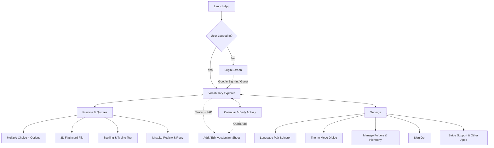

# 🌿 My Own Vocabulary

<p align="center">
  
</p>

<p align="center">
  <strong>A luxury, offline-first Android vocabulary learning & active-recall retention platform.</strong><br>
  Built with <strong>Kotlin 2.x</strong>, <strong>Jetpack Compose (Material 3)</strong>, <strong>AndroidX Room</strong>, <strong>Firebase Cloud Firestore</strong>, <strong>Android Credential Manager</strong>, and <strong>Native Text-To-Speech (TTS)</strong>.
</p>

<p align="center">
  
  
  
  
  
  
</p>

---

## 📖 Overview

**My Own Vocabulary** is an intuitive, aesthetic vocabulary companion designed for lifelong language learners. Whether mastering German genders (*der, die, das*), expanding travel Spanish, or cataloging professional terminology across 29+ global languages, **My Own Vocabulary** gives you total ownership over your personal lexicon.

Built with an offline-first philosophy, the app functions completely without internet access, while seamlessly synchronizing across your devices via Firebase Cloud Firestore whenever you are online.

---

## ✨ Key Features

### 🗂️ 1. 3-Tier Hierarchical Folder Structure
- **Main Folders ➔ Sub-Folders ➔ Sub-Sub Folders**: Organize vocabulary with granular nesting (e.g., `German A1` ➔ `Grammar & Verbs` ➔ `Modal Verbs`, or `Medical Terms` ➔ `Cardiology` ➔ `Pathology`).
- **Independent Language Pairs**: Configure source and target languages on a per-folder basis (e.g., German ➔ English, Spanish ➔ English, Japanese ➔ French).
- **Cascading Filters**: Filter vocabulary on the fly by selecting a main folder and narrowing down to specific sub-folders or sub-sub folders.
- **Folder Management (`Manage Folders`)**: Complete CRUD suite with full hierarchy visualization, folder reordering, deletion cascading, and source/target language configuration.

---

### 🎨 2. German Article & Gender Visual System
- Instant recognition with signature article color coding:
  - **`der`** (Masculine) ➔ Sapphire Blue (`#3B82F6`)
  - **`die`** (Feminine) ➔ Vibrant Rose / Crimson (`#F43F5E`)
  - **`das`** (Neuter) ➔ Emerald Green (`#10B981`)
  - **Other Parts of Speech** (Verbs, Adjectives, Adverbs, Phrases) ➔ Distinct badges and subtle tints.
- **One-Tap Article Filters**: Filter the vocabulary list with dedicated pill buttons for `der`, `die`, `das`, and favorites.

---

### 🧠 3. Interactive Practice & Active Recall Quizzes
Transform vocabulary lists into lasting knowledge with three specialized practice modes:
- **Multiple Choice (4 Options)**: Dynamic distractor generation from your vocabulary pool, real-time Emerald (correct) and Rose (mistake) visual feedback, haptic response, and auto-pronunciation.
- **3D Interactive Flashcards**: Smooth 3D flip card animation with front-to-back translation reveal and self-assessment scoring (*"Need Practice"* vs. *"Got It!"*).
- **Spelling & Typing Test**: Strengthen spelling accuracy with accent-tolerant checking, instant verification, and answer hints.
- **Mistake Review & Retry**: Comprehensive quiz summary detailing accuracy percentages, answered words breakdown, and a dedicated **"Retry Mistakes"** mode to master missed words.
- **Flexible Scope**: Practice your entire vocabulary or focus on a specific folder.

---

### 📅 4. Interactive Daily Calendar & Learning Streaks
- **Month Grid Navigation**: Intuitive month-by-month calendar view with glowing emerald indicators showing the exact word count added each day (e.g., `+5`).
- **Daily Activity Inspection**: Tap any calendar day to inspect words created on that date, listen to audio previews, toggle favorites, or quick-add words directly to that date.
- **Hero Streak Tracker**: Tracks your active daily learning streak, total vocabulary count, and mastered words milestone.

---

### 🔊 5. Authentic Native Text-To-Speech (TTS)
- **Engine**: Native `android.speech.tts.TextToSpeech` managed via a dedicated `TtsManager` with automatic `AudioManager` audio-focus ducking.
- **Intelligent Articulation**: Automatically prepends articles where appropriate (e.g. speaking *"das Auto"* or *"der Tisch"*) to reinforce gender memory.
- **29+ Supported Languages**: Locale resolution for German, English, Spanish, French, Italian, Portuguese, Dutch, Russian, Turkish, Polish, Swedish, Norwegian, Danish, Finnish, Greek, Czech, Hungarian, Romanian, Ukrainian, Japanese, Korean, Chinese, Arabic, Bengali, Hindi, Vietnamese, Indonesian, Thai, and Hebrew.
- **Configurable Speech**: Fine-tune speech rate (0.5x to 1.5x) and voice pitch in settings, complete with a live voice test button.
- **Smart Preferences**: Toggleable *"Auto-Pronounce on Save"* and *"Auto-Pronounce in Quiz"*.

---

### 💎 6. Luxury Emerald Design System
- **Palette**: Soft Emerald (`#2E9C7E`), Deep Green (`#1B3B34`), Emerald Glow (`#3DBFA0`), Dark Surfaces (`#0A0F0D`, `#111A17`, `#182420`, `#1F2E29`), and crisp light surfaces.
- **Tactile Physics**: Custom `bouncyClickable` spring animations on all cards, buttons, and navigation tabs.
- **Signature Bottom Bar**: Custom cradle cutout navigation bar with a floating center FAB (`+`) nestled in the cradle with an ambient breathing glow aura.
- **Typography**: Clean, contemporary Google Fonts **DM Sans** in Normal, Medium, SemiBold, Bold, and ExtraBold.
- **Glassmorphism**: Reusable `EmeraldGlassCard` featuring frosted gradients, delicate borders, and dynamic depth.
- **Theme Modes**: Full support for Dark Mode, Light Mode, and System Default.

---

### 🔒 7. Offline-First Architecture & Cloud Sync
- **Local Room Database**: Instant local reads and writes with Kotlin Coroutines and reactive `Flow`.
- **Firebase Authentication**: Sign in securely via modern **Android Credential Manager** (Google Sign-In) or explore instantly via **Guest / Offline Mode**.
- **Two-Way Cloud Sync**: Background synchronization with **Firebase Cloud Firestore** under `users/{userId}/...`, preserving folders, sub-folders, sub-sub-folders, and vocabulary entries across devices.
- **Firestore Offline Persistence**: Enables complete offline operation with automatic synchronization upon reconnection.
- **JSON Data Portability**: Complete JSON backup export and import functionality to safeguard or migrate your data at any time.

---

## 🏛️ Application Architecture

The project adheres to **Clean Architecture** principles and the **MVVM (Model-View-ViewModel)** pattern with **Unidirectional Data Flow (UDF)**:

```
com.sahed.my_own_vocabulary
├── data
│   ├── local
│   │   ├── dao                   # MainFolderDao, SubFolderDao, SubSubFolderDao, VocabularyEntryDao
│   │   ├── entity                # Room Entities: MainFolderEntity, SubFolderEntity, SubSubFolderEntity, VocabularyEntryEntity
│   │   ├── AppDatabase.kt        # Room Database configuration (Room 2.8.5)
│   │   └── DatabasePrepopulator.kt# Clean slate initialization
│   ├── preferences               # AppPreferences with Jetpack DataStore (Themes, TTS, Notifications)
│   └── repository                # AuthRepository, SyncRepository, VocabularyRepository
├── ui
│   ├── components                # VocabBottomBar (Cradle Cutout + FAB), MainFolderLanguageDialog
│   ├── designsystem
│   │   ├── components            # EmeraldGlassCard, AppBackground, bouncyClickable, StatCards, HeroStreakCard
│   │   └── theme                 # Color, Shape, Type (DM Sans), EmeraldDesignTheme
│   ├── navigation                # AppNavGraph & AppRoutes (Compose Navigation 2.8.8)
│   └── screens
│       ├── login                 # Modern Google Sign-In & Guest login screen
│       ├── vocabulary            # Main vocabulary browser, search bar, folder & article filters
│       ├── entry                 # Add / Edit vocabulary modal bottom sheet with 3-tier folder selector
│       ├── quiz                  # Multiple Choice, 3D Flashcards, Spelling & Mistake Review
│       ├── calendar              # Monthly grid calendar & daily vocabulary log
│       └── settings              # App Settings, TTS sliders, Theme, Manage Folders, Donations
└── util
    ├── DateUtils.kt              # Calendar formatting & year utilities
    ├── JsonBackupHelper.kt       # JSON backup export and import engine
    ├── LanguageRegistry.kt       # Catalog of 29+ supported languages with flags & greetings
    └── TtsManager.kt             # Native Android TextToSpeech & audio focus manager
```

---

## 🛠️ Technology Stack & Dependencies

| Category | Technology / Library | Version | Description |
| :--- | :--- | :--- | :--- |
| **Language** | [Kotlin](https://kotlinlang.org/) | `2.x` | Modern, expressive language with Coroutines & Flow |
| **Compiler** | [Compose Compiler Plugin](https://developer.android.com/develop/ui/compose/compiler) | `2.4.20` | Kotlin 2.x official Compose compiler plugin |
| **Build System** | [Android Gradle Plugin](https://developer.android.com/build) | `9.4.1` | Modern Android application build plugin |
| **UI Framework** | [Jetpack Compose BOM](https://developer.android.com/jetpack/compose) | `2025.02.00` | Declarative UI toolkit with Material 3 |
| **Navigation** | [Navigation Compose](https://developer.android.com/jetpack/compose/navigation) | `2.8.8` | Type-safe declarative screen navigation with transitions |
| **Local Database** | [AndroidX Room](https://developer.android.com/training/data-storage/room) | `2.8.5` | SQLite object mapping with Kotlin KAPT |
| **Key-Value Store** | [DataStore Preferences](https://developer.android.com/topic/libraries/architecture/datastore) | `1.1.3` | Asynchronous, reactive preference storage |
| **Authentication** | [Credential Manager](https://developer.android.com/training/sign-in/credential-manager) | `1.5.0-rc01` | Modern Android Google Sign-In & credential API |
| **Identity** | [GoogleID](https://developers.google.com/identity/android-credential-manager) | `1.1.1` | Google ID Token Credential provider |
| **Cloud Backend** | [Firebase BOM](https://firebase.google.com/docs/android/setup) | `33.9.0` | Firebase Authentication & Cloud Firestore |
| **Image Loading** | [Coil Compose](https://coil-kt.github.io/coil/compose/) | `2.7.0` | Asynchronous image loading for profile avatars |
| **Audio & Speech** | Native Android `TextToSpeech` | Built-in | Multilingual voice pronunciation with audio focus |
| **Typography** | [Google Fonts](https://fonts.google.com/specimen/DM+Sans) | DM Sans | Downloadable font provider via Compose Text |

---

## 🌐 Supported Languages (Language Registry)

The app features a built-in `LanguageRegistry` supporting **29+ languages** with native names, country metadata, flags, and TTS audio sample playback:

| Code | Flag | Language | Native Name | Code | Flag | Language | Native Name |
| :---: | :---: | :--- | :--- | :---: | :---: | :--- | :--- |
| `de` | 🇩🇪 | German | Deutsch | `da` | 🇩🇰 | Danish | Dansk |
| `en` | 🇬🇧 | English | English | `fi` | 🇫🇮 | Finnish | Suomi |
| `es` | 🇪🇸 | Spanish | Español | `el` | 🇬🇷 | Greek | Ελληνικά |
| `fr` | 🇫🇷 | French | Français | `cs` | 🇨🇿 | Czech | Čeština |
| `it` | 🇮🇹 | Italian | Italiano | `hu` | 🇭🇺 | Hungarian | Magyar |
| `pt` | 🇵🇹 | Portuguese | Português | `ro` | 🇷🇴 | Romanian | Română |
| `nl` | 🇳🇱 | Dutch | Nederlands | `uk` | 🇺🇦 | Ukrainian | Українська |
| `ru` | 🇷🇺 | Russian | Русский | `ja` | 🇯🇵 | Japanese | 日本語 |
| `tr` | 🇹🇷 | Turkish | Türkçe | `ko` | 🇰🇷 | Korean | 한국어 |
| `pl` | 🇵🇱 | Polish | Polski | `zh` | 🇨🇳 | Chinese | 中文 |
| `sv` | 🇸🇪 | Swedish | Svenska | `ar` | 🇸🇦 | Arabic | العربية |
| `no` | 🇳🇴 | Norwegian | Norsk | `bn` | 🇧🇩 | Bengali | বাংলা |
| `hi` | 🇮🇳 | Hindi | हिन्दी | `vi` | 🇻🇳 | Vietnamese | Tiếng Việt |
| `id` | 🇮🇩 | Indonesian | Bahasa Indonesia | `th` | 🇹🇭 | Thai | ไทย |
| `he` | 🇮🇱 | Hebrew | עברית | | | | |

---

## 📱 Navigation & Screen Flow



---

## 🚀 Getting Started

### Prerequisites
- **Android Studio**: Ladybug (2024.2.1+) or Meerkat (2024.3.1+) recommended
- **JDK**: Java Development Kit 17 or 21+
- **Android SDK**: Platform 36 (Minimum SDK: 26 / Android 8.0 Oreo)
- **Google Play Services**: Required for Google Sign-In & Firebase Sync

### Clone & Build

```bash
# 1. Clone the repository
git clone https://github.com/sahedalomsumit/my-own-vocabulary.git
cd my-own-vocabulary

# 2. Open in Android Studio or build via command line:
# On Windows (PowerShell / CMD):
.\gradlew.bat assembleDebug

# On macOS / Linux:
./gradlew assembleDebug

# 3. Install on a connected Android device or emulator:
.\gradlew.bat installDebug
```

### Firebase Setup (Optional for Cloud Sync)
1. Create a project on the [Firebase Console](https://console.firebase.google.com/).
2. Enable **Authentication** (Google Sign-In provider and Anonymous provider).
3. Enable **Cloud Firestore** in production or test mode.
4. Download your `google-services.json` and place it in the `app/` directory (`app/google-services.json`).
5. Build and run the app. If running without Firebase credentials, the app operates gracefully in **offline-first local mode**.

---

## 🛡️ Security & Privacy
- **Zero Third-Party Trackers**: No intrusive advertising SDKs or analytics trackers.
- **Offline First**: All vocabulary data is stored locally in your device's private SQLite database.
- **Encrypted Sync**: Firebase Cloud Firestore sync uses TLS encryption and enforces per-user security rules (`request.auth.uid == userId`).

---

## 👨‍💻 Author & Contributions

Crafted with care by **Sahed Alom Sumit**.

- 🌐 **Website**: [sahedalomsumit.com](https://sahedalomsumit.com)
- 💼 **GitHub**: [@sahedalomsumit](https://github.com/sahedalomsumit)
- ☕ **Support Development**: [Donate via Stripe](https://donate.stripe.com/7sY9AS57S4XL7F4aqP8AE03)

---

## 📄 License

This project is licensed under the terms of the **MIT License**. See [LICENSE](LICENSE) for details.